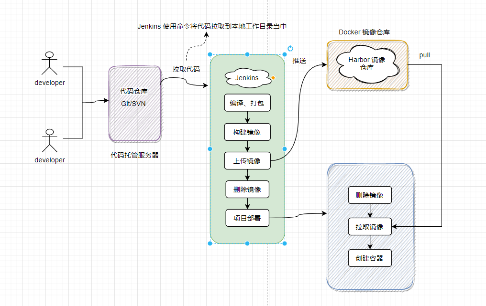

[返回首页](../../README.md)

## `CI/CD` 持续集成和持续交付
记录一下如何使用 `Jenkins` 进行项目自动化部署的流程
### `Jenkins` 自动化部署的原理
> Jenkins 可以使用服务器提供的登录凭证，登录到远程服务器当中，执行 `Shell` 脚本从而实现自动化部署。此外，Jenkins 提供了
很多插件进行功能扩展，如 Git、Docker、HTTP 等插件，这样可以使用这些工具提供的一些命令，如拉取代码、执行 Docker 命令、发送 HTTP 请求等。 
下面是一张简单的原理图：


> 另外可以使用 Docker 进行部署，这样的优势是：一次构建，到处运行。可以通过网络，快速分发运行打包好的软件：
我们可以从镜像仓库快速获取构建好的镜像，然后生成容器直接运行，就像直接从应用市场里直接获取软件进行安装一样方便，
可以帮我们省去服务迁移重新打包构建部署等繁琐的步骤。
### 基础环境配置与搭建
#### Docker 的使用与安装
> 具体可以参考：https://vuepress.mirror.docker-practice.com/，以下是简单的安装流程
```bash
# 使用脚本自动安装
curl -fsSL get.docker.com -o get-docker.sh
sudo sh get-docker.sh --mirror Aliyun
# 启动 Docker 并设置开机启动
sudo systemctl enable docker
sudo systemctl start docker
```
#### 使用 Docker 安装基础软件
##### `Jenkins`
```bash
docker run -d -p 8060:8080 -p 50000:50000 \
--user=root \
--name jenkins --privileged=true \
--restart=always \
-v /data/jenkins/jenkins_home:/var/jenkins_home \  #Jenkins 目录挂载
-v /data/maven/apache-maven-3.6.3:/usr/local/maven \
-v /data/jdk/jdk1.8.0_161:/usr/local/java \
-v /var/run/docker.sock:/var/run/docker.sock \  #Docker 相关目录挂载，这样做才能使用 Docker 命令
-v /usr/bin/docker:/usr/bin/docker \    
-v /data/node/node-v14.16.1-linux-x64:/usr/local/nodejs \ #NodeJS 目录挂载
jenkins/jenkins
```
##### `NodeJS`
> 用于前端工程打包
```bash
cd /data/nodejs
wget https://npm.taobao.org/mirrors/node/v14.16.1/node-v14.16.1-linux-x64.tar.xz
xz -d node-v14.16.0-linux-x64.tar.xz
tar -xzvf node-v14.16.0-linux-x64.tar
# 配置环境变量
export NODE_HOME=/data/nodejs/node-v14.16.1-linux-x64
export PATH=$NODE_HOME/bin:$PATH
# 检测是否安装成功
node -v
```
##### `Maven`
```bash
cd /home/mydata/data/maven
wget https://mirrors.aliyun.com/apache/maven/maven-3/3.6.3/binaries/apache-maven-3.6.3-bin.tar.gz
# 解压缩
tar -xzvf apache-maven-3.6.3-bin.tar.gz
# 环境变量配置：添加环境变量
vim /etc/profile
export M2_HOME=/home/mydata/maven/repo 
export MAVEN_HOME=/home/mydata/maven/apache-maven-3.6.3
export PATH=$PATH:${MAVEN_HOME}/bin
# 刷新配置
source /etc/profile         
```
##### `Nginx`
```bash
# 从容器当中复制配置文件到指定目录
docker run -p 80:80 --name nginx
docker cp nginx:/etc/nginx/nginx.conf /data/nginx
docker cp nginx:/etc/nginx/conf.d/ /data/nginx
docker stop nginx
docker rm nginx
# 生成容器并挂载目录
docker run -p 80:80 --name nginx --restart always \
--net host \
-v /data/nginx/html:/usr/share/nginx/html \  
-v /data/nginx/nginx.conf:/etc/nginx/nginx.conf \ #主配置文件挂载
-v /data/nginx/conf.d:/etc/nginx/conf.d \ 
-v /data/nginx/logs:/var/log/nginx -d nginx  # 日志挂载
```
> `nginx` 配置文件
```
# 反向代理配置（docker registry 服务）
 location / {
      proxy_pass http://127.0.0.1:5000;
      proxy_set_header X-Real-IP $remote_addr;
      proxy_set_header X-Forwarded-For $proxy_add_x_forwarded_for;
      proxy_set_header X-Forwarded-Proto $scheme;
      proxy_set_header Host $http_host;
      client_max_body_size 1024m;
 }
# 网关服务配置
 upstream gateway_server {
     server 192.168.20.15:8096;
     server 192.168.20.20:8096; 
     server 192.168.20.35:8096;
     keepalive 768; #长链接配置
 }
 server {
         listen   1023;
         server_name  localhost;
         ignore_invalid_headers off;
         client_max_body_size 0;
         proxy_buffering off;
         location / {
              proxy_set_header X-Real-IP $remote_addr;
              proxy_set_header X-Forwarded-For $proxy_add_x_forwarded_for;
              proxy_set_header X-Forwarded-Proto $scheme;
              proxy_set_header Host $http_host;
              proxy_connect_timeout 300s;
              proxy_http_version 1.1;
              proxy_set_header Upgrade $http_upgrade; #长连接配置
              proxy_set_header Connection "upgrade";
              proxy_read_timeout 36000s;
              proxy_send_timeout 36000s;
              chunked_transfer_encoding off;
              proxy_pass http://gateway_server;
         }
 }

```
##### Redis
> 单节点
```bash
# 单节点
docker run -d --name redis --restart always -p 6379:6379 -v /home/mydata/redis/data:/data redis --appendonly yes --requirepass "2022@abc123.."
```
> 集群
- 1、创建 redis-cluster.tmpl 模板（redis.conf 配置文件）
```bash
#端口
port ${PORT}
#非保护模式
protected-mode no
#启用集群模式
cluster-enabled yes 
cluster-config-file nodes.conf 
#超时时间
cluster-node-timeout 5000 
#集群各节点IP地址
cluster-announce-ip 192.168.0.111 
#集群节点映射端口 
cluster-announce-port ${PORT} 
#集群总线端口 
cluster-announce-bus-port 1${PORT} 
#开启aof持久化策略
appendonly yes
#后台运行
#daemonize yes
#进程号存储
pidfile /var/run/redis_${PORT}.pid 
#集群加密
#masterauth 123456
#requirepass 123456
```
- 2、创建 docker 网络
```bash
docker network create redis-net
```
- 3、使用脚本 redis.sh 创建集群
```bash
#!/bin/bash 
#在/data/redis/redis-cluster下生成conf和data目标，并生成配置信息 
for port in `seq 7001 7006`;
do
  mkdir -p ./${port}/conf && PORT=${port} envsubst < ./redis-cluster.tmpl > ./${port}/conf/redis.conf && mkdir -p ./${port}/data; 
done
#创建6个redis容器
for port in `seq 7001 7006`;
do
    docker run -d -it -p ${port}:${port} -p 1${port}:1${port} -v /data/redis/redis-cluster/${port}/conf/redis.conf:/usr/local/etc/redis/redis.conf -v /data/redis/redis-cluster/${port}/data:/data --privileged=true --restart always --name redis-${port} --net redis-net --sysctl net.core.somaxconn=1024 redis redis-server /usr/local/etc/redis/redis.conf;
done
#查找ip
for port in `seq 7001 7006`; do
echo -n "$(docker inspect --format '{{ (index .NetworkSettings.Networks "redis-net").IPAddress }}' "redis-${port}")":${port}" ";
done
#换行
echo -e "\n"
#输入信息
read -p "请把输入要启动的docker容器名称，默认redis-7001:" DOCKER_NAME #判断是否为空
if [ ! $DOCKER_NAME ];
    then DOCKER_NAME='redis-7001';
fi
#进入容器
docker exec -it redis-7001 /bin/bash
```
- 4、节点关联
```bash
# 进入到任意一个安装好的redis节点的bin目录，里面有个脚本对象redis-cli，
docker exec -it redis-7001 bash
cd /usr/local/bin/
# 执行集群创建
./redis-cli --cluster create 172.18.0.3:7002 172.18.0.4:7003 172.18.0.5:7004 172.18.0.6:7005 172.18.0.7:7006 --cluster-replicas 1 -a 123456
# 验证
redis-cli -p 7001 -c -a 123456
cluster nodes
```
- 5、停止容器
```bash
#!/bin/bash
docker stop redis-7001 redis-7002 redis-7003 redis-7004 redis-7005 redis-7006
docker rm redis-7001 redis-7002 redis-7003 redis-7004 redis-7005 redis-7006
rm -rf 7001 7002 7003 7004 7005 7006
```

##### `MongoDB`
```bash
docker run --name mongo \
-p 27017:27017 --restart=always \
-v /data/mongo/data:/data/db \
-v /data/mongo/conf:/data/conf \
-v /data/mongo/log:/data/log \
-d mongo

docker exec -it mongo mongo admin #( docker exec -it mongo mongosh # mongo5.0以上的版本 )
db.createUser({user:'admin',pwd:'admin',roles:[{role:'readWrite',db:'admin'}],})
db.auth('admin','admin')
show users
db.createUser({user:'admin',pwd:'admin',roles:[{role:'readWrite',db:'mall-portal-dev'}]})
db.updateUser('admin', {roles:[{role:"readWrite",db:"mall-portal-dev"}]});
use database
db.createUser({user:'admin',pwd:'admin',roles:[{role:'readWrite',db:'mall-portal-dev'}]})
```
> `MongoDB` 配置文件(`mongodb.conf`)
```properties
#端口
port=27017
#数据库文件存放目录
dbpath=/data/mongo/data
#日志文件存放路径
logpath=/data/mongo/log
#使用追加方式写日志
logappend=true
#以守护线程的方式运行，创建服务器进程
fork=true
#最大同时连接数
maxConns=100
#不启用验证
#noauth=true
#每次写入会记录一条操作日志
journal=true
#存储引擎有mmapv1、wiredTiger、mongorocks
storageEngine=wiredTiger
#访问IP
bind_ip=0.0.0.0
#用户验证
#auth=true
```
##### `ES` 、`kibana` 、`logstash`
```bash
# 创建目录 /data/es 及其子目录，设置权限
chmod 777 /data/es
# 下载镜像
docker pull docker.elastic.co/elasticsearch/elasticsearch:7.6.2
docker pull docker.elastic.co/kibana/kibana:7.6.2
docker pull docker.elastic.co/logstash/logstash:7.6.2 
# 查看镜像ID
docker image 
# 安装 ES
docker run --name elasticsearch -p 9200:9200 -p 9300:9300 \
--restart=always \
-e "discovery.type=single-node" \
-e ES_JAVA_OPTS="-Xms512m -Xmx1024m" \
-v /data/es/config/elasticsearch.yml:/usr/share/elasticsearch/config/elasticsearch.yml \
-v /data/es/data:/usr/share/elasticsearch/data \
-v /data/es/plugins:/usr/share/elasticsearch/plugins \
-d container_id
# ES 配置文件修改
echo "http.host: 0.0.0.0">> /data/es/config/elasticsearch.yml
# 安装 kibana
docker run --name kibana -e ELASTICSEARCH_HOSTS=http://192.168.150.58:9200 -p 5601:5601 -d container_id
# 下载 IK 分词器
wget https://github.com/medcl/elasticsearch-analysis-ik/releases/download/v7.6.2/elasticsearch-analysis-ik-7.6.2.zip
# 测试是否安装成功
POST _analyze
{
  "analyzer": "ik_max_word",
  "text":"测试数据"
}
# 将压缩包放到 /data/es/plugins/ik 目录下,重启ES
docker restart elasticsearch
# logstash
docker run --name logstash -p 4560:4560 -p 4561:4561 -p 4562:4562 -p 4563:4563 \
--restart=always \
-e ES_JAVA_OPTS="-Xms512m -Xmx1024m" \
-v /data/logstash/config:/usr/share/logstash/config \
-v /data/logstash/pipeline:/usr/share/logstash/pipeline \
-d fa5b3b1e9757

docker run -d --name=logstash fa5b3b1e9757

docker cp logstash:/usr/share/logstash/config /data/logstash/
docker cp logstash:/usr/share/logstash/pipeline /data/logstash/

# 进入logstash容器
docker exec -it logstash /bin/bash
# 进入bin目录
cd /bin/
# 安装插件
logstash-plugin install logstash-codec-json_lines
# 退出容器
exit
# 重启logstash服务
docker restart logstash
```
##### `RabbitMQ` 
```bash
mkdir -p /data/rabbitmq/{data,conf,log}
chmod -R 777 /data/rabbitmq #   授权

docker run -p 5672:5672 -p 15672:15672 \
-v /data/rabbitmq/data:/var/lib/rabbitmq \
-v /data/rabbitmq/conf:/etc/rabbitmq \
-v /data/rabbitmq/log:/var/log/rabbitmq \
--name rabbitmq -d rabbitmq:management

docker exec -it rabbitmq bash
rabbitmq-plugins enable rabbitmq_management

docker exec -it rabbitmq /bin/bash
rabbitmqctl add_user admin admin #创建用户 
rabbitmqctl set_user_tags admin administrator #给用户授权角色
rabbitmqctl set_permissions -p / admin "." "." ".*" #给用户添加权限
```
### 部署脚本示例
```groovy
pipeline {
   agent any

   //环境变量，变量名称都可以自定义，在后面的脚本中使用
   environment {
      //git仓库
	  GIT_REGISTRY = 'http://ip:port/xxx.git'
	  //分支
	  GIT_BRANCH = 'develop'
	  //凭证
	  GITLAB_ACCESS_TOKEN_ID = 'xxxx-xxx-xxxx-xxx'
	  //docker 仓库地址
	  REGISTRY_HOST = 'ip:5000'
      //镜像tag
      TAG = "v1.0.${currentBuild.number}"
      //日志目录，容器内目录
      LOG_DIR = '/var/logs'
      LOG_FILE_URL = '/logs'
       //宿主机目录
      LOG_FILE = "/home/logs/xxx"
      JVM_ARG = "-server -Xms1024m -Xmx1024m  -XX:+HeapDumpOnOutOfMemoryError  -XX:HeapDumpPath=${LOG_DIR}/dump/dump-yyy.log  -XX:ErrorFile=${LOG_DIR}/jvm/jvm-crash.log"
      //远程发布服务，这样可以绕过堡垒机进行部署
      REMOTE_EXECUTE_HOST = 'http://ip:port/shell'
   }

   stages {
      stage('Build') {
         steps {
            // 获取代码
            git credentialsId: "${env.GITLAB_ACCESS_TOKEN_ID}", url: "${env.GIT_REGISTRY}", branch: "${env.GIT_BRANCH}"
            // maven 打包
            //sh "mvn --projects ${project_name} --also-make clean install"
            sh "mvn clean install"
         }
      }
      stage('Image Build') {
      	// 将jar包拷贝到Dockerfile所在目录，并制作镜像
      	steps {
      		sh '''
                project_dir="${project_name}"
                // 条件判断，可以修改编译后文件的目录地址
                if [ "${project_name}" = "system" ] || [ "${project_name}" = "base" ] ] ; then
                     project_dir="dir/${project_name}"
                fi
                rm -rf ./docker/jenkins/${project_name}
                mkdir ./docker/jenkins/${project_name}
                cp ./docker/jenkins/Dockerfile ./docker/jenkins/${project_name}
      	        cp ./${project_dir}/target/*.jar ./docker/jenkins/${project_name}/${project_name}.jar
      	        cd ./docker/jenkins/${project_name}
                sed -i "s/PROJECT_NAME/${project_name}/g" Dockerfile
                echo '================开始制作并上传镜像================'
                docker build -t ${project_name} .
                echo '================制作镜像完成================'
                cd ..
                rm -rf ${project_name}
      		'''
      	}
      }
      stage('Image Push') {
            //将制作好的镜像推送到镜像仓库
      		steps {
      			sh "echo '================上传镜像================'"
                  sh "docker tag ${project_name}:latest ${env.REGISTRY_HOST}/${project_name}:${env.TAG}"
                  sh "docker push ${env.REGISTRY_HOST}/${project_name}:${env.TAG}"
      			sh "echo '================镜像上传成功================'"
      			sh "docker rmi ${env.REGISTRY_HOST}/${project_name}:${env.TAG}"
      			sh "docker rmi ${project_name}:latest"
      		}
            //steps {
              //      script {
                         //定义函数
                //        def toLowerCase = {
                  //          input ->input.toLowerCase()
                 //       }
                 //       def moduleName = toLowerCase("${project_name}")
                //	    sh "echo '================上传镜像================'"
                //      sh "docker tag ${moduleName}:latest ${env.REGISTRY_HOST}/${moduleName}:${env.TAG}"
                //      sh "docker push ${env.REGISTRY_HOST}/${moduleName}:${env.TAG}"
                //	    sh "echo '================镜像上传成功================'"
                //	    sh "docker rmi ${env.REGISTRY_HOST}/${moduleName}:${env.TAG}"
                //	    sh "docker rmi ${moduleName}:latest"
                //	}
            //}
      }
      stage('Execute service') {
       		steps {
       		    //以下整个脚本都依赖jenkins插件：HTTP Request
       		    //将body转换为json
                script {
                     def toJson = {
                       input ->
                       groovy.json.JsonOutput.toJson(input)
                     }
                     //部署的一些模块名称
                     def map = ['gateway':'8100','system':'8300']
                     def port
                     for ( e in map ) {
                         if("${project_name}" == "${e.key}"){
                               print "key = ${e.key}, value = ${e.value}"
                               port = "${e.value}"
                          }
                     }
       			    //body定义,根据实际情况而定
       			    def body = [
                         imageName: "${env.REGISTRY_HOST}/${project_name}",
                         tag: "${env.TAG}",
                         port: "${port}" ,
                         simpleImageName: "${project_name}",
                         envs: [
                              JVM_ARGS: "${env.JVM_ARG}",
                              'spring.profiles.active': "dev",
                              '-jasypt.encryptor.password': "xxxxxxx"
                         ],
                         volumes: ["${env.LOG_FILE}:${env.LOG_FILE_URL}"]
                    ]
       			    sh "echo '================开始调用目标服务器发布================'"
       			    response = httpRequest acceptType: 'APPLICATION_JSON', consoleLogResponseBody: true, contentType: 'APPLICATION_JSON', httpMode: 'POST', requestBody: toJson(body), responseHandle: 'NONE', url: "${env.REMOTE_EXECUTE_HOST}"
       		        sh "echo '================结束调用目标服务器发布================'"
       		   }
       	  }
        }
    }
}

```
#### `Dockerfile` 文件示例
```
# 该镜像需要依赖的基础镜像
FROM java:8
# 将当前目录下的jar包复制到docker容器的/目录下
ADD PROJECT_NAME-1.0-SNAPSHOT.jar /PROJECT_NAME-1.0-SNAPSHOT.jar
# 声明服务运行在8088端口
EXPOSE 8080
# 指定docker容器启动时运行jar包
ENTRYPOINT ["java","-Xmx512m","-jar","/PROJECT_NAME-1.0-SNAPSHOT.jar"]
# 指定维护者的名字
MAINTAINER K
```

